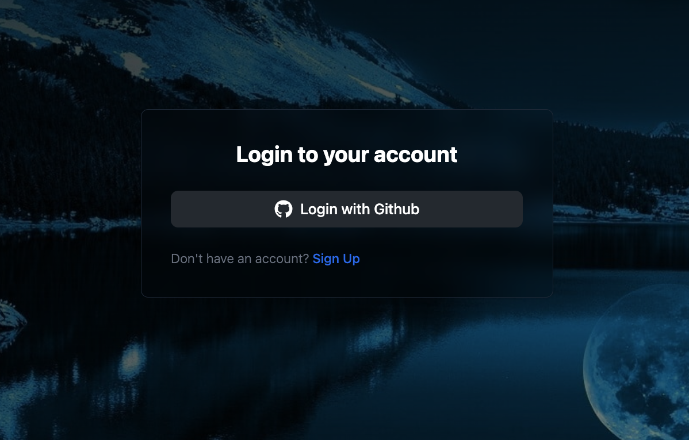
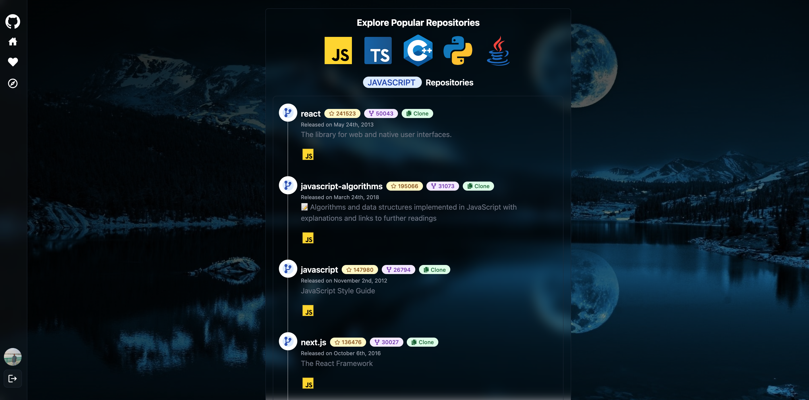
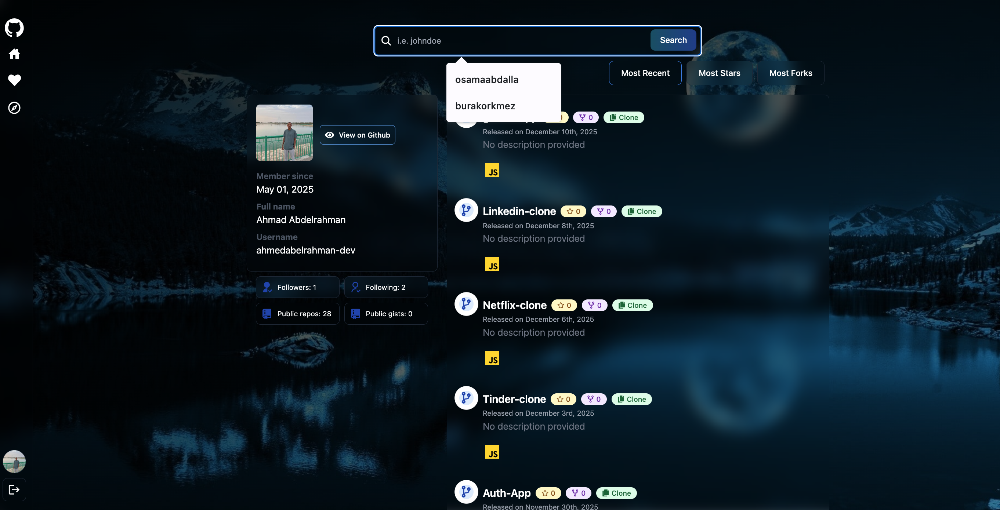

# GitHub App

A full-stack web application for exploring GitHub profiles and repositories. Users can search for GitHub users, view their profiles and repositories, explore popular repositories by programming language, and like/favorite profiles.


## Features

- 🔐 **GitHub OAuth Authentication** - Secure login using GitHub credentials
- 🔍 **Profile Search** - Search for any GitHub user by username
- 📊 **Repository Management** - View and sort repositories by:
  - Most recent
  - Number of stars
  - Number of forks
- 🌐 **Explore Repositories** - Discover popular repositories filtered by programming language (JavaScript, TypeScript, Python, Java, C++, etc.)
- ❤️ **Like Profiles** - Save your favorite GitHub profiles
- 📱 **Responsive Design** - Modern UI built with Tailwind CSS

## Tech Stack

### Frontend

- **React 19** - UI library
- **React Router DOM** - Client-side routing
- **Vite** - Build tool and dev server
- **Tailwind CSS** - Utility-first CSS framework
- **React Hot Toast** - Toast notifications
- **React Icons** - Icon library

### Backend

- **Node.js** - Runtime environment
- **Express.js** - Web framework
- **MongoDB** - Database (via Mongoose)
- **Passport.js** - Authentication middleware
- **Passport GitHub Strategy** - GitHub OAuth integration
- **Express Session** - Session management
- **CORS** - Cross-origin resource sharing

## Prerequisites

Before running this application, make sure you have the following installed:

- **Node.js** (v14 or higher)
- **npm** or **yarn**
- **MongoDB** (local installation or MongoDB Atlas account)
- **GitHub OAuth App** credentials (Client ID and Client Secret)

## Installation

1. **Clone the repository**

   ```bash
   git clone <repository-url>
   cd github-app
   ```

2. **Install backend dependencies**

   ```bash
   npm install
   ```

3. **Install frontend dependencies**
   ```bash
   cd frontend
   npm install
   cd ..
   ```

## Environment Variables Setup

1. **Create a `.env` file in the root directory** (`/backend` folder or root):

   ```env
   PORT=5000
   MONGODB_URI=your_mongodb_connection_string
   GITHUB_CLIENT_ID=your_github_client_id
   GITHUB_CLIENT_SECRET=your_github_client_secret
   CLIENT_BASE_URL=http://localhost:5173
   SESSION_SECRET=your_session_secret_key
   ```

2. **Set up GitHub OAuth App**:

   - Go to GitHub Settings → Developer settings → OAuth Apps
   - Click "New OAuth App"
   - Set Application name: `GitHub App`
   - Set Homepage URL: `http://localhost:5173`
   - Set Authorization callback URL: `http://localhost:5000/api/auth/github/callback`
   - Copy the Client ID and Client Secret to your `.env` file

3. **Set up MongoDB**:
   - Option 1: Use MongoDB Atlas (cloud)
     - Create a free account at [MongoDB Atlas](https://www.mongodb.com/cloud/atlas)
     - Create a cluster and get your connection string
   - Option 2: Use local MongoDB
     - Install MongoDB locally
     - Use connection string: `mongodb://localhost:27017/github-app`

## How to Run

### Development Mode

1. **Start the backend server** (from root directory):

   ```bash
   npm run dev
   ```

   The backend will run on `http://localhost:5000`

2. **Start the frontend development server** (in a new terminal):

   ```bash
   cd frontend
   npm run dev
   ```

   The frontend will run on `http://localhost:5173`

3. **Open your browser** and navigate to `http://localhost:5173`

### Production Mode

1. **Build the frontend**:

   ```bash
   cd frontend
   npm run build
   ```

2. **Start the backend server**:
   ```bash
   npm start
   ```

## Project Structure

```
github-app/
├── backend/
│   ├── controllers/       # Request handlers
│   ├── db/                # Database connection
│   ├── middleware/        # Custom middleware
│   ├── models/            # MongoDB models
│   ├── passport/          # Passport.js strategies
│   ├── routes/            # API routes
│   └── server.js          # Express server entry point
├── frontend/
│   ├── public/            # Static assets
│   └── src/
│       ├── components/    # React components
│       ├── context/       # React context providers
│       ├── pages/         # Page components
│       ├── utils/         # Utility functions
│       └── main.jsx       # React entry point
└── github-app/            # Screenshots
```

## Screenshots

### Login Page



### Home Page - Profile Search


### Explore Page - Popular Repositories



### Search Results



## API Endpoints

### Authentication

- `GET /api/auth/github` - Initiate GitHub OAuth
- `GET /api/auth/github/callback` - GitHub OAuth callback
- `GET /api/auth/check` - Check authentication status
- `GET /api/auth/logout` - Logout user

### Users

- `GET /api/users/profile/:username` - Get GitHub user profile and repositories
- `GET /api/users/:username` - Get user data from database
- `POST /api/users/like/:username` - Like a profile
- `GET /api/users/likes` - Get liked profiles

### Explore

- `GET /api/explore/repos/:language` - Get popular repositories by language

## Available Scripts

### Root Directory

- `npm start` - Start backend server
- `npm run dev` - Start backend server with nodemon (auto-reload)

### Frontend Directory

- `npm run dev` - Start Vite dev server
- `npm run build` - Build for production
- `npm run preview` - Preview production build
- `npm run lint` - Run ESLint

## Troubleshooting

### Common Issues

1. **MongoDB Connection Error**

   - Ensure MongoDB is running (if using local MongoDB)
   - Check your `MONGODB_URI` in `.env` file
   - Verify network access if using MongoDB Atlas

2. **GitHub OAuth Not Working**

   - Verify `GITHUB_CLIENT_ID` and `GITHUB_CLIENT_SECRET` in `.env`
   - Check that callback URL matches GitHub OAuth app settings
   - Ensure `CLIENT_BASE_URL` matches your frontend URL

3. **CORS Errors**

   - Ensure backend CORS is configured correctly
   - Check that frontend and backend URLs match your `.env` settings

4. **Port Already in Use**
   - Change `PORT` in `.env` file
   - Or kill the process using the port: `lsof -ti:5000 | xargs kill`

## Contributing

Contributions are welcome! Please feel free to submit a Pull Request.

## License

ISC

## Author

Built with ❤️ using React and Node.js
